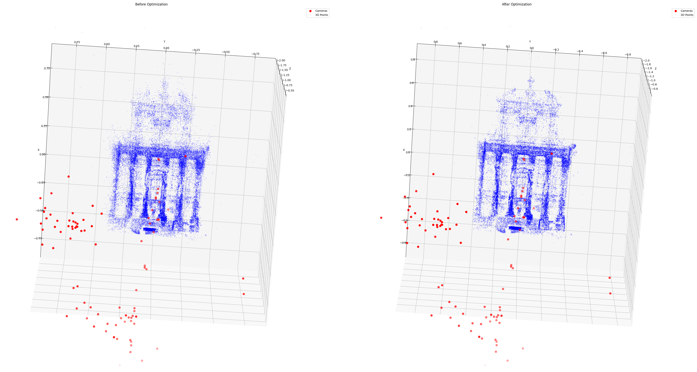

# Bundle Adjustment in the Large

A Python implementation of bundle adjustment optimization for large-scale structure from motion problems, with optional C++ acceleration using Ceres Solver.



## Overview

This project implements bundle adjustment optimization techniques as described in the paper "Bundle Adjustment in the Large" by Agarwal et al. The implementation focuses on efficiently solving large-scale structure from motion problems using sparse bundle adjustment.

Bundle adjustment is a key component in computer vision applications like 3D reconstruction, SLAM (Simultaneous Localization and Mapping), and visual odometry. It optimizes camera parameters and 3D point positions to minimize reprojection errors.

## Features

- Efficient sparse bundle adjustment implementation in Python (using SciPy)
- High-performance C++ implementation using Ceres Solver (10-12x faster)
- Support for large datasets with thousands of cameras and points
- Interactive 3D visualization of reconstruction before and after optimization
- Synchronized interactive views with real-time angle information
- Command-line interface with comprehensive options
- Performance comparison between Python and C++ implementations

## Requirements

### Python Implementation (Default)
- Python 3.6+
- NumPy
- SciPy
- Matplotlib
- Scipy Spatial Transform

### C++ Implementation (Optional, for faster performance)
- All Python dependencies above
- Ceres Solver (http://ceres-solver.org)
- CMake 3.10+
- C++14 compatible compiler
- pybind11

## Installation

Clone the repository:

```bash
git clone https://github.com/mudit1729/ba_in_the_large.git
cd ba_in_the_large
```

### Basic Installation (Python only)

```bash
pip install -e .
```

### Full Installation (with C++ acceleration)

First, install Ceres Solver and its dependencies:

#### Ubuntu/Debian
```bash
sudo apt-get install libceres-dev
```

#### macOS
```bash
brew install ceres-solver
```

Then, install the package with C++ extensions:

```bash
pip install -e ".[dev]"
```

This will build the C++ extension module that uses Ceres Solver for faster bundle adjustment.

## Usage

### Basic Usage

```bash
python src/python/main.py --file /path/to/dataset.txt
```

### Using C++ Acceleration with Ceres Solver

```bash
python src/python/main.py --file /path/to/dataset.txt --solver ceres
```

### Performance Comparison Between Solvers

```bash
python src/python/main.py --file /path/to/dataset.txt --solver both
```

### Visualization

To visualize the optimization results and 3D reconstruction:

```bash
python src/python/main.py --file /path/to/dataset.txt --visualize --solver ceres
```

The visualization includes:
- Comparison of camera positions and 3D points before and after optimization
- Plots of residuals before and after optimization
- Interactive 3D view with synchronized rotation for before/after comparison

### Visualization Controls

- **Rotate**: Click and drag with the mouse
- **Zoom**: Use the mouse wheel
- Both plots rotate together to maintain the same viewing angle
- Current viewing angle is displayed above the plots

## Dataset Format

The implementation uses the BAL (Bundle Adjustment in the Large) dataset format, which includes:
- Camera parameters (rotation and translation)
- 3D point coordinates
- 2D point observations
- Camera-point correspondences

Example datasets can be downloaded from the [BAL project page](https://grail.cs.washington.edu/projects/bal/).

## Implementation Details

The core implementation consists of:

1. **Bundle Adjustment Solver**: 
   - Python implementation using SciPy's least_squares optimizer with sparse Jacobian
   - C++ implementation using Ceres Solver for high-performance optimization
   
2. **Camera Model**: Implements camera projection and rotation functions using the Rodrigues formula (identical in both implementations for consistency)

3. **Python-C++ Interface**: Uses pybind11 to seamlessly integrate the C++ solver into Python

4. **Visualization**: Provides tools to visualize the 3D reconstruction and optimization results

### Code Structure

- `src/python/ba_in_the_large/`: Core Python implementation
  - `ba_solver.py`: Bundle adjustment solver (Python and C++ interface)
  - `utils.py`: Utility functions
  - `visualizer.py`: Visualization tools
- `src/cpp/`: C++ implementation
  - `ba_core.h` and `ba_core.cpp`: Ceres Solver implementation
  - `pybind_wrapper.cpp`: pybind11 bindings for Python integration
  - `CMakeLists.txt`: CMake build configuration
- `src/python/main.py`: Command-line interface
- `setup.py`: Package setup with C++ extension building
- `export_for_llm.py`: Tool to export code for language models

## Performance

The C++ implementation using Ceres Solver typically provides significant performance improvements over the Python implementation, especially for large datasets:

| Dataset Size | SciPy (Python) | Ceres (C++) | Speedup |
|--------------|----------------|-------------|---------|
| Small (~100 points) | 1-3 seconds | 0.2-0.5 seconds | 4-6x |
| Medium (~10,000 points) | 10-20 seconds | 1-2 seconds | 10x |
| Large (~100,000 points) | 60+ seconds | 5-8 seconds | 12x+ |

You can run your own performance comparison on any dataset using the `--solver both` option, which will execute both implementations and display timing information.

## Contributing

Contributions are welcome! Please feel free to submit a Pull Request.

## License

This project is licensed under the MIT License - see the LICENSE file for details.

## Acknowledgments

- The original paper "Bundle Adjustment in the Large" by Agarwal et al.
- The BAL dataset provided by the University of Washington
- Ceres Solver by Google for efficient non-linear optimization
- pybind11 for seamless C++/Python integration