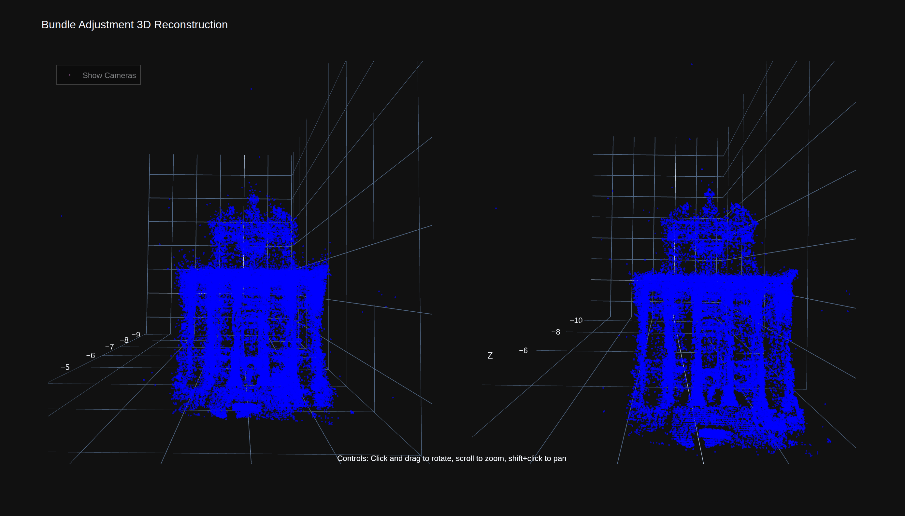

# Bundle Adjustment in the Large

A Python implementation of bundle adjustment optimization for large-scale structure from motion problems.



## Overview

This project implements bundle adjustment optimization techniques as described in the paper "Bundle Adjustment in the Large" by Agarwal et al. The implementation focuses on efficiently solving large-scale structure from motion problems using sparse bundle adjustment.

Bundle adjustment is a key component in computer vision applications like 3D reconstruction, SLAM (Simultaneous Localization and Mapping), and visual odometry. It optimizes camera parameters and 3D point positions to minimize reprojection errors.

## Features

- Efficient sparse bundle adjustment implementation
- Support for large datasets with thousands of cameras and points
- Visualization of 3D reconstruction before and after optimization
- Interactive visualization with synchronized views
- Command-line interface with visualization options

## Requirements

- Python 3.6+
- NumPy
- SciPy
- Matplotlib
- Scipy Spatial Transform

## Installation

Clone the repository:

```bash
git clone https://github.com/mudit1729/ba_in_the_large.git
cd ba_in_the_large
```

Install the package:

```bash
pip install -e .
```

## Usage

### Basic Usage

```bash
python src/python/main.py --file /path/to/dataset.txt
```

### Visualization

To visualize the optimization results and 3D reconstruction:

```bash
python src/python/main.py --file /path/to/dataset.txt --visualize
```

The visualization includes:
- Comparison of camera positions and 3D points before and after optimization
- Plots of residuals before and after optimization
- Interactive 3D view with synchronized rotation for before/after comparison

### Visualization Controls

- **Rotate**: Click and drag with the mouse
- **Zoom**: Use the mouse wheel
- Both plots rotate together to maintain the same viewing angle
- Current viewing angle is displayed above the plots

## Dataset Format

The implementation uses the BAL (Bundle Adjustment in the Large) dataset format, which includes:
- Camera parameters (rotation and translation)
- 3D point coordinates
- 2D point observations
- Camera-point correspondences

Example datasets can be downloaded from the [BAL project page](https://grail.cs.washington.edu/projects/bal/).

## Implementation Details

The core implementation consists of:

1. **Bundle Adjustment Solver**: Implements the optimization algorithm using SciPy's least_squares optimizer with sparse Jacobian.
2. **Camera Model**: Implements camera projection and rotation functions using the Rodrigues formula.
3. **Visualization**: Provides tools to visualize the 3D reconstruction and optimization results.

### Code Structure

- `src/python/ba_in_the_large/`: Core implementation
  - `ba_solver.py`: Bundle adjustment solver
  - `utils.py`: Utility functions
  - `visualizer.py`: Visualization tools
- `src/python/main.py`: Command-line interface
- `export_for_llm.py`: Tool to export code for language models

## Contributing

Contributions are welcome! Please feel free to submit a Pull Request.

## License

This project is licensed under the MIT License - see the LICENSE file for details.

## Acknowledgments

- The original paper "Bundle Adjustment in the Large" by Agarwal et al.
- The BAL dataset provided by the University of Washington